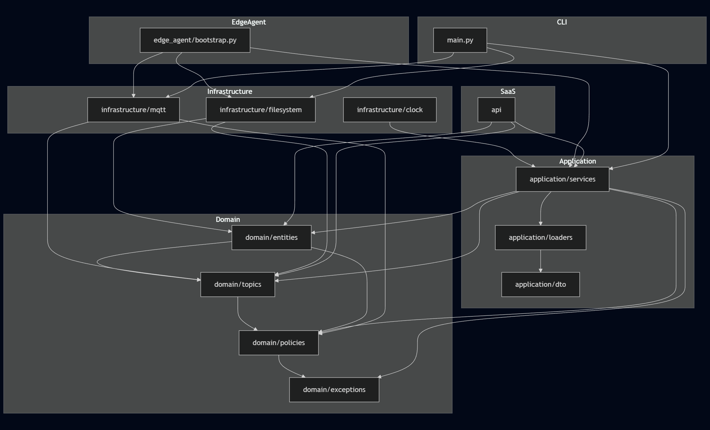

# Doc
Key rules enforced by this graph
* Domain never depends on infrastructure
* Infrastructure depends on domain, never the opposite
* Application orchestrates domain + infrastructure
* Edge agent and SaaS are just runtime shells
* Topic grammar remains reusable everywhere



## Mental model
```text
Domain  ←  Application  ←  Runtime (Edge/SaaS/CLI)
   ↑
Infrastructure
```

# MVP
Who could and possibly would buy?
* Agriculture tech companies
* Manufacturing plants
* Utilities
* Logistics firms
* Smart building vendors
* Robotics companies
* Universities

All of them struggle with:
* MQTT chaos
* security
* topic sprawl
* multi-tenant routing
* ACL management

Positioning: **Secure multi-tenant IoT messaging platform with edge deployment**